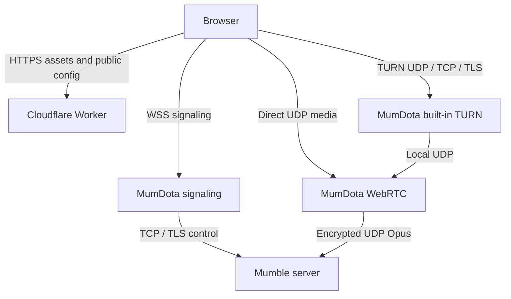

# MumDota

MumDota is a Rust Mumble ↔ WebRTC bridge with **built-in STUN/TURN**. One process handles browser signaling, ICE relay fallback, Mumble TCP/TLS control and Mumble UDP audio. No coturn process, sidecar or third-party TURN service is required.

The web application can stay on Cloudflare Workers. The browser opens WSS directly to MumDota's HTTPS ingress and sends WebRTC media from the user's network to MumDota. ICE normally selects direct UDP; when direct connectivity is unavailable it can use MumDota's own TURN over UDP, TCP or TLS.



TURN's TCP/TLS listener carries browser media through a TCP/TLS connection; the local TURN-to-WebRTC hop remains UDP, as in [RFC 8656](https://www.rfc-editor.org/rfc/rfc8656.html#section-3.1). This is a dedicated relay for MumDota, not a general-purpose TURN endpoint for other applications.

## Build and verify

Use Rust 1.94.0+, OpenSSL development libraries and CA certificates.

```bash
cargo fmt --all -- --check
cargo clippy --locked --all-targets -- -D warnings
cargo test --locked
cargo build --locked --release
cargo run -- config.local.toml
```

The tests include real TURN allocations over UDP/TCP/TLS, revocation, actual ICE/DTLS/SRTP media with two independent speakers, ICE restart and local Mumble session failure cases. The ignored test that targets an external Mumble server is opt-in.

GitHub Actions checks source changes on PRs and publishes images only on `master` or `v*` tags. Pin the tested image digest for deployment.

## Configuration

The tracked `config.toml` is a runnable direct-only default that connects to a local Mumble server at `127.0.0.1:64738`. Set `MUMDOTA_MUMBLE_HOST` to the actual upstream host before deploying or upgrading; there is no built-in production host. Enable TURN explicitly and set the reachable public IPv4 address before deployment. Keep private configuration in an ignored `config.local.toml` or environment variables. No TURN shared secret or static username/password is needed.

All domains below are examples. Keep the real upstream host, TURN hostname and allowed website origins in deployment configuration, such as Kubernetes ConfigMaps/Secrets or an ignored `deploy/kubernetes.local.yaml`. Removing public source references does not erase Git history or hide addresses from connected browsers.

```toml
[server]
listen_addr = "0.0.0.0"
listen_port = 8080
max_connections = 100
allowed_origins = ["https://example.com"] # Replace with the deployed website origin.

[mumble]
host = "m.example.com"
port = 64738
accept_invalid_certs = true # Set false when the upstream has a trusted certificate.

[webrtc]
udp_port = 50000
public_ip = "203.0.113.10" # Replace with your server's public IPv4.
stun_servers = []

[turn]
enabled = true
listen_addr = "0.0.0.0"
port = 3478
public_ip = "203.0.113.10" # Must equal webrtc.public_ip.
public_host = "turn.example.com" # DNS-only A record pointing to that IPv4.
realm = "mumdota"
relay_min_port = 49160
relay_max_port = 49999
credential_ttl_secs = 3600
tls_port = 5349
tls_cert = "/etc/mumdota/tls/tls.crt"
tls_key = "/etc/mumdota/tls/tls.key"
```

Omit both TLS file fields to disable the TLS listener; UDP and TCP remain available. The certificate chain must be valid for `public_host`, in PEM format with its matching PKCS#8 PEM private key. Renew the mounted certificate through your existing certificate manager, then restart MumDota to load it. WebSocket TLS is terminated separately by the HTTP ingress/reverse proxy.

`server.allowed_origins` checks browser WebSocket origins. An empty list accepts all origins; clients without an Origin header remain supported. This check is not a replacement for Mumble authentication. WebSocket capacity is reserved before login, with message size, handshake and idle limits.

Environment variables override TOML values. TOML also supports `${VAR}` and `${VAR:-default}` interpolation. The complete overrides are:

| Prefix | Suffixes |
| --- | --- |
| `MUMDOTA_SERVER_` | `LISTEN_ADDR`, `LISTEN_PORT`, `MAX_CONNECTIONS`, `ALLOWED_ORIGINS` (CSV) |
| `MUMDOTA_MUMBLE_` | `HOST`, `PORT`, `ACCEPT_INVALID_CERTS` |
| `MUMDOTA_WEBRTC_` | `UDP_PORT`, `PUBLIC_IP`, `STUN_SERVERS` (optional CSV for direct-only browser sessions) |
| `MUMDOTA_TURN_` | `ENABLED`, `LISTEN_ADDR`, `PORT`, `PUBLIC_IP`, `PUBLIC_HOST`, `REALM`, `RELAY_MIN_PORT`, `RELAY_MAX_PORT`, `CREDENTIAL_TTL_SECS`, `TLS_PORT`, `TLS_CERT`, `TLS_KEY` |

The old `MUMDOTA_WEBRTC_TURN_USERNAME` and `MUMDOTA_WEBRTC_TURN_CREDENTIAL` settings are no longer consumed. The server uses its fixed media socket and public IP, without contacting an external ICE service.

## Docker and Kubernetes

For Linux Docker, host networking preserves the configured media port and local TURN routing:

```bash
docker run -d --name mumdota --network host \
  -v /etc/mumdota/config.toml:/app/config.local.toml:ro \
  -v /etc/mumdota/tls:/etc/mumdota/tls:ro \
  ghcr.io/cherrs/mumdota:master config.local.toml
```

For Kubernetes, copy [deploy/kubernetes.yaml](deploy/kubernetes.yaml) to ignored `deploy/kubernetes.local.yaml` and edit that private copy. It uses one `hostNetwork` pod on a selected node, `Recreate` updates, an HTTP Service/Ingress, and a mounted TURN certificate Secret. Replace all example domains (including the upstream host and allowed origin), public IP, node label, image digest and TLS Secret names; adapt the ingress class to your cluster. Ensure the selected node has `mumdota-media=true`. The TURN certificate Secret must contain `tls.crt` and `tls.key`; an existing coturn certificate for the same hostname can be reused by changing the Secret reference.

Keep one replica per advertised endpoint. Credentials and allocations are process-local; placing independent replicas behind a randomly balanced TURN/WS address will break authentication and media affinity. Scaling requires routing each session to the same MumDota instance for WSS, media and TURN.

### Ports and DNS

| Endpoint | Exposure | Purpose |
| --- | --- | --- |
| `voice.example.com:443/TCP` | Public ingress | WSS signaling and HTTP health |
| `8080/TCP` | Ingress / cluster only | MumDota HTTP backend |
| Public IPv4 `50000/UDP` | Public, preserve port through NAT | Shared WebRTC media socket |
| `turn.example.com:3478/UDP` | Public | STUN and TURN UDP |
| `turn.example.com:3478/TCP` | Public | TURN TCP |
| `turn.example.com:5349/TCP` | Public if TLS enabled | TURN TLS |
| `127.0.0.1:49160–49999/UDP` | Local process network only | TURN allocations for MumDota media |
| Upstream `64738/TCP+UDP` | Outbound + reply traffic | Mumble control and encrypted voice |

The allocation sockets bind loopback and relay only to the configured MumDota public media endpoint, internally mapped to loopback. This avoids depending on NAT hairpin behavior and prevents using the credentials to reach arbitrary destinations. The allocation range does not need a public Kubernetes Service or firewall opening. Leave enough local ports for all listener candidates and overlapping allocations during credential refresh; the default range has 840 ports.

Use a DNS-only A record for `turn.example.com`; do not attach it to the Worker or a normal HTTP Ingress. TURN TLS is not HTTPS. Standard Cloudflare proxying covers [specific HTTP/HTTPS ports](https://developers.cloudflare.com/fundamentals/reference/network-ports/), so this deployment connects directly to the TURN server. To make WSS itself direct, also use DNS-only for `voice.example.com`. The website's main domain can keep its existing Worker/CDN configuration.

IPv4 media and TURN allocations are supported. An IPv6-only browser network needs IPv4 reachability/NAT64; native IPv6 TURN allocations and TURN TCP peer allocations (RFC 6062) are not implemented.

## Protocol v2 and credentials

1. Browser opens `/ws` and sends `{"type":"connect","data":{"username":"name"}}`.
2. After Mumble authentication, `connected.data` includes `protocol_version: 2`, users/channels and `ice: {ice_servers, expires_at}`. Expiry is Unix seconds. Credentials are unique to this WS session and exist only in memory.
3. A voice-enabled browser creates its peer connection with those ICE servers, adds its microphone and sends `{"type":"start_voice"}`. A text-only session does not start Mumble UDP voice.
4. **MumDota creates every SDP offer**. Browser handles `offer`, applies the remote SDP, creates an answer and sends `{"type":"answer","data":{"sdp":"..."}}`. New speakers cause renegotiation. ICE candidates trickle both ways using `candidate`, `sdp_mid`, `sdp_mline_index`.
5. Browser sends `ice_refresh` before credential expiry. MumDota returns `ice_config`; browser updates its ICE configuration, then requests `ice_restart`. The server queues negotiations while an earlier offer is outstanding. Old credentials overlap briefly so a restart can finish.
6. ICE failure triggers one restart, then a full WS/Mumble reconnect if recovery times out. A lost Mumble connection produces a terminal error and closes the WS; credentials and allocations are revoked.

The old client-initiated `offer` receives `upgrade_required`. Update the web frontend and MumDota together; cached old tabs must refresh. Do not cache TURN credentials in the Worker or browser storage. Expiry is checked on authentication; expired credentials cannot refresh allocations. Session teardown explicitly deletes allocations.

Each Mumble speaker has a separate Opus RTP track, stream ID and clock. Mumble frame numbers advance in 10ms units; RTP timestamps use 48kHz. The bridge preserves packet gaps, drops stale/late packets and forwards Opus without transcoding or a shared pacing queue. The browser mixes the independent tracks.

## Migration from coturn

1. Build and verify both protocol-v2 PRs. Prepare MumDota's public IP, TURN DNS record, ports and certificate mount.
2. Remove the coturn Deployment/sidecar from your deployment configuration. If it owns the same host ports, stop it during the coordinated rollout before starting the built-in listeners. Keep the previous manifest/image for rollback.
3. Deploy the updated MumDota and web frontend in the same maintenance window. The Worker needs only the WSS/health URLs; remove its old `MUMBLE_PROXY_STUN_SERVERS`, `MUMBLE_PROXY_TURN_USERNAME` and `MUMBLE_PROXY_TURN_CREDENTIAL` bindings. Rotate/revoke old coturn credentials after the transition.
4. Reload open browser tabs. Verify direct voice and the forced relay cases below before considering the rollout complete.
5. If rollback is needed, restore the previous frontend, MumDota and coturn configurations together.

## Health and acceptance checks

- `/health` returns `ok` for process liveness.
- `/ready` returns 200 only when an upstream Mumble TCP connection is reachable; otherwise 503. JSON includes `upstream_tcp_reachable`, active `sessions`, `builtin_turn` and `media_udp_port`. This is a readiness probe, not proof of Mumble authentication or usable audio.
- In the frontend's **连接质量** panel, check the selected route, transport, RTT, receive jitter and cumulative receive packet loss. The chosen ICE pair is used, not any obsolete successful pair.
- Serve `client.html` over HTTPS (localhost HTTP is also suitable for local tests). Use `?relay=1&turnTransport=udp`, `?relay=1&turnTransport=tcp` and `?relay=1&turnTransport=tls` to force and isolate each built-in listener. Inspect the selected relay candidate in browser WebRTC diagnostics; two clients should hear each other and two simultaneous native Mumble speakers should remain independent.
- Test across Wi-Fi/mobile networks, disable/re-enable the client network, leave a call open past the credential TTL, and restart the upstream Mumble server. Confirm the UI clears stale connected state and recovers.

SIGTERM/CTRL-C stops WebSockets, sessions, the media mux and TURN listeners. No live deployment is changed by running the source tests.
